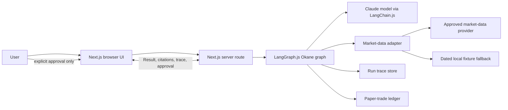
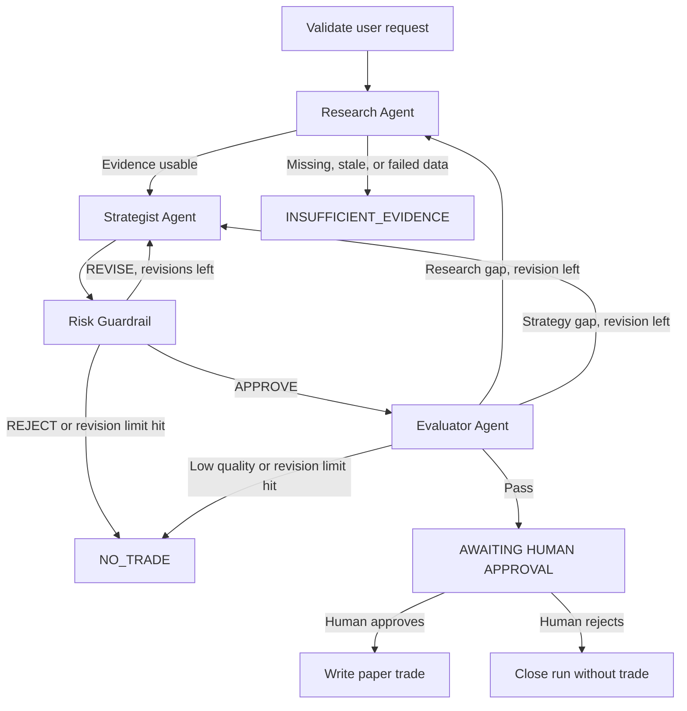

# Okane Architecture

## 1. System purpose

Okane is a web-based, multi-agent research system for **educational paper trading of a small, tested set of NSE equities**. It translates a user research request into an evidence-backed proposed trade, independently challenges the proposal for risk and quality, and requires human approval before recording a simulated order.

The architectural goal is not to automate trading. It is to demonstrate why coordinated specialists produce a safer, more inspectable result than one generic chat response.

## 2. Architectural principles

1. **Agent graph, not fixed workflow.** LangGraph.js owns conditional routing. A result from one agent determines what happens next.
2. **Structured shared state.** Zod schemas define graph state and all agent outputs. Invalid output is a safe error/retry/no-trade path.
3. **Evidence before recommendation.** Claims are accompanied by source, retrieval timestamp, and data-quality status.
4. **Independent risk veto.** A Strategist cannot override Risk Guardrail.
5. **Human control.** Only a human can approve a simulated trade; there is no brokerage/order API.
6. **Traceability over cleverness.** Every agent handoff, tool/fallback use, and route decision is recorded.
7. **Graceful degradation.** When a provider or model fails, show cached fixture/demo data only when clearly labelled, otherwise issue `NO_TRADE`.

## 3. System context



### Trust boundaries

| Boundary | Allowed | Not allowed |
|---|---|---|
| Browser → server | Validated research request and approval decision | API keys, raw provider credentials, direct model access |
| Server → model | Sanitized/evidence-bounded prompt and schema | Treating model output as authoritative data |
| Server → data provider | Narrow symbol/horizon query through adapter | Unbounded requests, unapproved scraping, secret exposure |
| Server → persistence | Approval-gated paper-trade record and trace metadata | Real order submission or storage of secrets in trace |

## 4. Component design

### Next.js application

- **Server route:** accepts a validated request and invokes the graph. It is the only entry point for models/data providers.
- **Research UI:** collects stock symbol, horizon, portfolio value, and optional thesis; displays result, source metadata, disclaimer, and approval control.
- **Trace UI:** presents a chronological agent timeline, elapsed times, route reasons, fallback markers, and terminal status.

### Integration layer

- **Configuration:** validates server-only environment variables and demo-mode flag.
- **Market adapter:** hides provider specifics; exposes a normalized market snapshot. It reports provider, retrieval time, and confidence/data quality.
- **Fixture adapter:** returns a dated known-good scenario only for test/demo mode or a documented provider fallback. It must never be presented as live.
- **Persistence interfaces:** begin with an in-memory/demo-safe implementation; plug into Vercel-compatible durable storage only after the flow works.

### Agent layer

| Agent | Inputs | Output | Authority |
|---|---|---|---|
| Research | Request, market snapshot, retrieved context | Evidence brief, citations, confidence, data-quality status | Can request retry/fallback or terminate insufficient evidence |
| Strategist | Evidence brief, request constraints | Direction, entry/target/stop, horizon, rationale, confidence | May propose, never execute |
| Risk Guardrail | Proposal, portfolio value, price/volatility inputs | Approve/revise/reject, position size, stop, risk/reward, reasons | Can veto or constrain Strategist |
| Evaluator | Proposal, risk review, evidence, trace timings | Quality score, bias/citation flags, next-route recommendation | Can request bounded revision or permit human approval |

## 5. Shared state contract

`OkaneState` is defined in one Zod schema and inferred into TypeScript. Each node receives a read-only view and returns a partial state update.

```ts
type RunStatus =
  | "RUNNING"
  | "AWAITING_HUMAN_APPROVAL"
  | "NO_TRADE"
  | "INSUFFICIENT_EVIDENCE"
  | "ERROR";

type OkaneState = {
  requestId: string;
  request: {
    symbol: string;
    horizonDays: number;
    portfolioValueInr: number;
    thesis?: string;
    mode: "paper";
  };
  marketSnapshot?: MarketSnapshot;
  evidence: Evidence[];
  researchBrief?: ResearchBrief;
  tradeProposal?: TradeProposal;
  riskReview?: RiskReview;
  evaluation?: Evaluation;
  trace: TraceEvent[];
  routeReason?: string;
  researchRevisionCount: number;
  strategyRevisionCount: number;
  status: RunStatus;
  errors: StructuredError[];
};
```

Important invariants:

- `mode` is always `paper`.
- `status=AWAITING_HUMAN_APPROVAL` requires a validated proposal, Risk `APPROVE`, and Evaluator permission.
- a persisted simulated trade requires both `status=AWAITING_HUMAN_APPROVAL` and explicit UI approval.
- `researchRevisionCount` and `strategyRevisionCount` each have a maximum of one for the MVP.
- any missing critical evidence or invalid model output results in an explainable terminal state, never an invented value.

## 6. Conditional graph



The state’s `routeReason` explains every conditional edge. This is essential evidence for CA3: evaluators must see agents responding to evidence, disagreement, risk, or quality—not simply passing output through four named functions.

## 7. Run lifecycle

1. **Validate:** browser submits a symbol, horizon 1–10, positive portfolio value, optional thesis, and `paper` mode. Invalid input is rejected before graph/model calls.
2. **Research:** retrieve market snapshot and curated context; record provider/fallback and source metadata. Insufficient evidence terminates safely.
3. **Strategize:** produce a falsifiable, schema-validated proposal. A proposal includes an invalidation/stop condition.
4. **Risk:** calculate stop distance, maximum loss, maximum position size, and risk/reward deterministically; return explanation plus decision.
5. **Evaluate:** check completeness, citations, confidence calibration, trace health, and basic run metrics; ask for revision or permit approval.
6. **Human approval:** display only an approved-for-review proposal. The human approves or rejects.
7. **Record:** write only the approved simulated order, and retain its run/trace ID.

## 8. Trace event design

Every trace event has this minimum shape:

```json
{
  "runId": "run_2026-10-08_001",
  "at": "2026-10-08T10:00:00.000Z",
  "agent": "risk_guardrail",
  "event": "completed",
  "inputSummary": "BUY proposal for RELIANCE.NS",
  "outputSummary": "REVISE: risk/reward below 1.5",
  "routeReason": "Proposal target is too close to entry for stated stop loss",
  "elapsedMs": 246,
  "dataMode": "fixture",
  "error": null
}
```

For real-provider data, `dataMode` is `provider` and source/retrieval metadata must be recorded. Do not place API keys, full prompts containing secrets, or unnecessary personally identifiable information in traces.

## 9. Quality and safety behaviour

| Condition | System response |
|---|---|
| Unsupported symbol/input | Validation error before graph runs |
| Provider timeout/rate limit | Retry once only if safe; then labelled fixture fallback in demo mode or `INSUFFICIENT_EVIDENCE` |
| Model timeout/malformed output | Trace structured error; bounded retry or `NO_TRADE` |
| Missing citation/uncertain evidence | Evaluator requests revision or returns `NO_TRADE` |
| Zero/negative stop distance | Risk rejects proposal |
| Risk too high | Risk requests revision or rejects |
| Human rejection | End run with no ledger write |

## 10. Vercel deployment design

- Deploy the Next.js application to Vercel.
- Keep `ANTHROPIC_API_KEY` and provider keys in Vercel environment variables only.
- Server route handlers invoke models and providers; do not put keys in client components.
- Use external durable storage (for example Vercel Postgres/Neon) only if time remains after the in-memory/demo-safe flow works; serverless file-system persistence is not a production store.
- Ensure the app degrades to a labelled demo fixture or safe no-trade response if the external provider is unavailable during the demo.

## 11. Inspiration applied from FinIntel OS

FinIntel OS demonstrates a useful reference architecture: a LangGraph shared state, specialized agents, explicit fallbacks, timed per-agent execution logging, retrieval-grounded reasoning, confidence synthesis, persistent run metadata, and an inspectable dashboard. Okane applies those concepts to a smaller TypeScript/Next.js scope.

Okane intentionally differs in its domain contract: it uses Research, Strategist, Risk Guardrail, and Evaluator agents; exposes a bounded revise/no-trade path; gates all simulated execution behind a human decision; and does not copy FinIntel OS source code or represent its implementation as Okane’s own. [Reference repository](https://github.com/sahilpotdar1/finintel-os)
